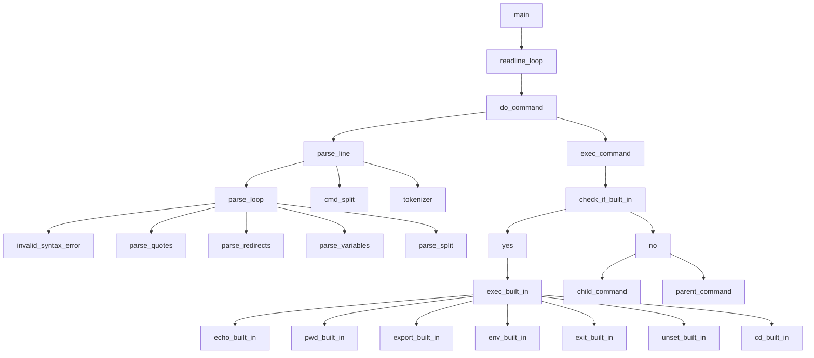

<h1>42-formation-lvl2-8.minishell</h1>

### _Project 8: MiniShell - Eighth project for the formation of software engineers at school 42 São Paulo._

- This project is about creating a simple shell.

<!-- ## _The project looked like this:_

 -->

## _Como utilizar_

- Clone the repository:
```
git clone git@github.com:Vinicius-Santoro/42-formation-lvl2-8.minishell.git
```
- Run the command to turn abstract files into object files:
```
make all
```
- Run the generated file and enjoy the minishell.
```
./minishell
```

## _How the project works_

Our minishell works as follows.

- Analysis and treatment of everything that was passed on the terminal.
- After the treatment, the arguments are tokenized, that is, each item is added to a node of a linked list (everything that arrives at this node is 100% OK).
- Checks if the node content is a builtin or an external command (the command is executed).

### _Project general fluxogram_


